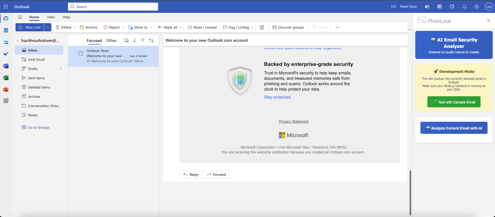

# PhishLook - Outlook Phishing Detection Extension

## 🎯 Project Overview

An AI-powered Outlook extension that automatically detects and flags potential phishing emails in real time. The extension analyzes email content, links, sender authenticity, and attachments against known red flags such as mismatched URLs, urgent or threatening language, false rewards, and suspicious requests for confidential information.

By combining AI-driven link analysis with a continuously updated phishing database, the tool empowers users to avoid falling prey to scams they might not otherwise recognise, ultimately enhancing digital safety and trust in online communication.

## 🚨 The Problem Statement

Many users struggle to distinguish between real and fake emails, as phishing messages often mimic legitimate organisations like banks, government agencies, or e-commerce platforms, leading to rising cases of scams, identity theft, and financial fraud.

## 💡 Our Solution

A comprehensive Outlook Web Add-in featuring:

- **Real-time Email Analysis** using advanced heuristics and AI-powered backend
- **Smart Risk Assessment** with traffic-light scoring system (0-100 scale)
- **Educational Explanations** for each detected threat with user-friendly warnings
- **Comprehensive Detection** across links, attachments, content, and sender patterns
- **Multi-layer Protection** with local analysis and AI validation

## 🔧 Technical Architecture

### Core Components

- **Frontend**: Office.js-based task pane with responsive UI (`src/taskpane/`)
- **Backend**: Express.js server with analysis APIs (`server.js` on port 3001)
- **Detection Engine**: Modular analyzer system (`detectors/`)
- **Database**: Real phishing URL database (30,000+ verified entries)
- **Development**: Webpack dev server configuration with HTTPS support

### Detection Modules

1. **SimpleSuspiciousnessDetector.js** - Core heuristic analysis engine
2. **OllamaDetector.js** - AI-powered content analysis with timeout handling
3. **Phishing Database** - Real-time URL verification against known threats

## 🔍 Advanced Detection Features

### 1. Link vs Text Mismatch Analysis ✅
- **Domain Spoofing Detection**: Identifies legitimate-looking domains with suspicious variations
- **URL Shortener Analysis**: Flags potentially dangerous shortened links (bit.ly, tinyurl, etc.)
- **Text-Link Mismatch**: Detects when displayed text doesn't match actual URL destination
- **Punycode Domain Detection**: Identifies internationalized domain spoofing attempts
- **Protocol Inconsistencies**: Flags HTTP links in HTTPS contexts

### 2. Suspicious Attachments Detection ✅
- **Dangerous Extensions**: Identifies high-risk file types (.exe, .scr, .pif, .bat, .cmd, .com)
- **Script Detection**: Flags potentially malicious scripts (.js, .vbs, .ps1, .jar)
- **Archive Analysis**: Detects suspicious compressed files (.zip, .rar, .7z)
- **Double Extension Detection**: Identifies files with deceptive naming (e.g., "document.pdf.exe")
- **Metadata Extraction**: Analyzes attachment properties and characteristics

### 3. Content Pattern Analysis
- **Urgent Language Detection**: AI-powered identification of pressure tactics
- **Credential Harvesting**: Detects requests for passwords, SSNs, banking info
- **Reward Schemes**: Identifies "too good to be true" offers and prizes
- **Social Engineering**: Recognizes manipulation techniques and trust exploitation

### 4. Sender Authentication
- **Display Name Spoofing**: Compares display name with actual email address
- **Domain Verification**: Validates sender domain authenticity
- **First-time Sender Alerts**: Flags emails from unknown contacts
- **Email Header Analysis**: Examines routing and authentication headers

### 5. Formatting Anomalies
- **Suspicious HTML Patterns**: Detects hidden or manipulated content
- **Character Encoding Issues**: Identifies obfuscation attempts
- **Typography Inconsistencies**: Flags unusual fonts, colors, or spacing

## 📊 Scoring System

PhishLook uses a weighted scoring algorithm (0-100 scale):

- **Text Analysis**: 30% - Content patterns, language, and social engineering
- **Link Analysis**: 20% - URL verification, domain spoofing, redirects
- **Attachment Analysis**: 20% - File types, extensions, metadata
- **Sentiment Analysis**: 20% - Emotional manipulation and urgency
- **Formatting Analysis**: 10% - HTML patterns and presentation anomalies

**Risk Levels**:
- 🟢 **Low (0-30)**: Likely legitimate
- 🟡 **Medium (31-60)**: Exercise caution
- 🔴 **High (61-100)**: Likely phishing attempt

## 🚀 Getting Started

### Prerequisites
- Node.js 14+ and npm
- Outlook Web (This extension only works with the web version of Outlook)

### Installation & Setup

1. **Clone and Install**:
```bash
git clone <rhttps://github.com/harithhh06/PhishLook.git>
cd PhishLook
npm install
```

2. **Start Development Servers**:
```bash
# Terminal 1: Start the analysis backend
node server.js

# Terminal 2: Start the Office Add-in dev server
npx webpack serve --mode development 
```

3. **Load in Outlook**:
   - Open Outlook Web
   - Go to Add-ins → Get Add-ins
   - Select `My Addins` > `Custom Addins` > `Add from file...`
   - Navigate to your Phishlook folder and open `manifest.xml` the click "Install"
   - From your Add-ins tab, select Phishlook to run it
   - PhishLook will appear on the right side of the outlook UI



4. **Using Phishlook**
    * Click`Test with sample email` to see different output results for some sample test emails

    * To test on an actual email
        * Open a selected email
        * Click `Analyse current email with AI`

## 🧪 Comprehensive Testing

The extension includes 10 built-in test scenarios covering:

1. **Suspicious PayPal Link** - Domain spoofing detection
2. **Fake Bank Alert** - Urgent language + credential harvesting
3. **CEO Fraud** - Display name spoofing
4. **Lottery Scam** - Reward scheme detection
5. **URL Shortener Phish** - Shortened link analysis
6. **Malicious Attachment** - Dangerous file detection
7. **Government Impersonation** - Authority spoofing
8. **Romance Scam** - Social engineering patterns
9. **Cryptocurrency Fraud** - Investment scam detection
10. **Tech Support Scam** - Service impersonation

Each test includes detailed explanations and expected detection results.

## 📁 Project Structure

```
PhishLook/
├── src/
│   ├── taskpane/
│   │   ├── taskpane.html          # Main UI interface
│   │   ├── taskpane.js            # Frontend logic & Office.js integration
│   │   └── taskpane.css           # Styling and responsive design
│   └── commands/
│       ├── commands.html          # Command interface
│       └── commands.js            # Command handlers
├── detectors/
│   ├── SimpleSuspiciousnessDetector.js  # Core analysis engine
│   └── OllamaDetector.js               # AI-powered detection
├── server.js                      # Express backend API
├── phishing_database.json         # Real phishing URL database
├── manifest.xml                   # Office Add-in manifest
├── webpack.config.js              # Build configuration
└── package.json                   # Dependencies and scripts
```

## 🔧 Configuration

### Backend Server (`server.js`)
- **Port**: 3001 (analysis API)
- **CORS**: Enabled for localhost development
- **SSL**: Self-signed certificates for HTTPS
- **Timeout**: 30-second AI analysis timeout

### Frontend (`taskpane.js`)
- **Office.js**: Integration with Outlook APIs
- **Real-time Analysis**: Email content extraction and processing
- **UI Updates**: Dynamic risk visualization and explanations

### Detection Configuration
- **Phishing Database**: 30,000+ verified malicious URLs
- **AI Analysis**: Ollama integration with fallback to heuristics
- **Scoring Weights**: Customizable risk factor weightings

## 🛡️ Security Features

- **Local Processing**: Core analysis performed locally for privacy
- **Secure Communication**: HTTPS-only API communication
- **No Data Storage**: Email content not persisted on servers
- **Minimal Permissions**: Only reads email content being analyzed
- **Offline Capability**: Basic detection works without internet connection

## 🔮 Future Enhancements

- **Machine Learning Models**: Custom-trained phishing classifiers
- **Real-time Database Updates**: Automatic phishing database synchronization
- **Advanced Attachment Scanning**: Behavioral analysis and sandboxing
- **Integration APIs**: Connect with enterprise security platforms
- **Multi-language Support**: Localized detection for global deployment

## 🤝 Contributing

1. Fork the repository
2. Create feature branch (`git checkout -b feature/amazing-feature`)
3. Commit changes (`git commit -m 'Add amazing feature'`)
4. Push to branch (`git push origin feature/amazing-feature`)
5. Open a Pull Request

## 📄 License

This project is licensed under the MIT License - see the LICENSE file for details.

## 🆘 Support

For support and questions:
- Create an issue in the GitHub repository
- Check the troubleshooting section in the wiki
- Review the comprehensive test scenarios for usage examples
